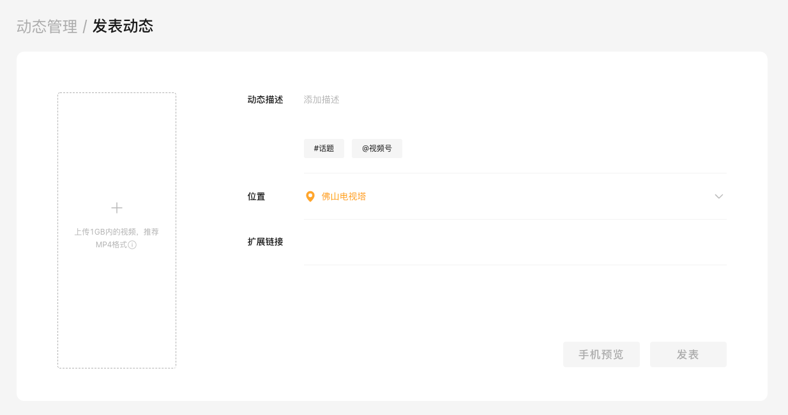

随着视频号的火热，越来越多的人开始加入视频号的创作中来。但是视频号的冷启动对于一般人来说一直是个头疼的问题。

## 一、为什么冷启动很重要？

因为视频号的底层是微信用户体系，所有人的初始播放量都是基于微信的好友关系链进行传播的。当一个视频达到一定的播放量后，才会得到微信官方的推荐，将视频放入一个更大的用户池。这个放量的过程不是一次性完成，而是分阶段进行的。

如果一个新的视频播放量少、点赞少、互动少，就得不到官方的推荐，所以说冷启动这相当于一条视频的生死线。

## 二、突破冷启动的2种方法

最常见的冷启动方法是视频号互赞，通常是视频号创作者之间相互点赞，形式可以是微信群，或者互赞系统。

还有一种方法，目标不是提高单个视频的播放量，而是将一个视频批量发布在多个账号，以此来达到共播放量变大的目标。

第二种方法你可以自己搭建视频号矩阵，或者使用利益诱导用户进行强制分享，就像下面介绍的视频号霸屏一样。

## 三、视频号霸屏的原理

1、视频创作者将视频动态发布上系统；
2、通过系统生成分享链接或二维码海报；
3、将链接/二维码使用话术包装好，引导用户点击/扫码；
4、用户扫码后，登录视频号助手 PC 后台；
5、通过模拟视频号后台操作，自动将原视频动态发布到用户的视频号。

视频号助手PC端，网址：https://channels.weixin.qq.com/login

获取动态二维码，引导用户扫码

发布视频动态

## 四、总结

视频号霸屏实际上是利益诱导用户授权登录视频号，然后悄悄的自动发布动态到用户视频号上面。这类软件对于特定人群的吸引力是很强的，所以变现能力也特别强。

但是这种实现技术，却存在一定的风险，不建议大家跟进，只提供一种思路。

